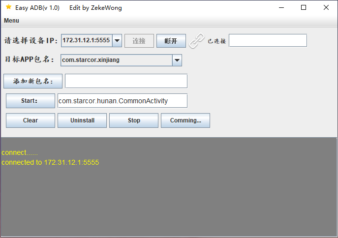

# EsayADB
An adb tool developed by Jswing.

Double click /ExecutorZip/EsayADB.bat to run.

Feature list:
----
* [x] Custom ip(port) address
* [x] Custom package name
* [x] Custom target activity to start
* [x] Clear app data
* [x] Stop app
* [x] Uninstall app
* [ ] Device Connection status monitoring
